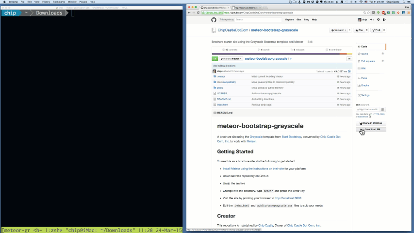

# meteor-bootstrap-grayscale

A brochure site using the 
[Grayscale](http://startbootstrap.com/template-overviews/grayscale/) template from [Start Bootstrap](http://startbootstrap.com/), converted by [Chip Castle Dot Com, Inc.](http://chipcastle.com) to work with [Meteor](http://meteor.com).

## Getting Started

To use this as a brochure site, do the following to get started:
* [Install Meteor using the instructions on their
  site](https://www.meteor.com/install) for your platform

* Download this repository on GitHub

* Unzip the archive

* Change into the directory, type `meteor` and press the Enter key

* Visit the site by pointing your browser to [http://localhost:3000](http://localhost:3000)

* Edit the `index.html` and `public/css/grayscale.css` files to suit your needs.

## Creator

This repository is maintained by [Chip
Castle](http://github.com/chip), Owner of [Chip Castle Dot Com, Inc.](http://chipcastle.com). 

* https://twitter.com/chipcastle
* https://github.com/chipcastledotcom

Start Bootstrap was created by and is maintained by **David Miller**, Managing Parter at [Iron Summit Media Strategies](http://www.ironsummitmedia.com/).

* https://twitter.com/davidmillerskt
* https://github.com/davidtmiller

Start Bootstrap is based on the [Bootstrap](http://getbootstrap.com/) framework created by [Mark Otto](https://twitter.com/mdo) and [Jacob Thorton](https://twitter.com/fat).

## Copyright and License

Copyright 2013-2015 Iron Summit Media Strategies, LLC. Code released under the [Apache 2.0](https://github.com/IronSummitMedia/startbootstrap-grayscale/blob/gh-pages/LICENSE) license.
